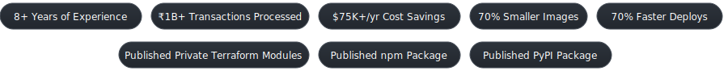

Open to local + global remote opportunities

<b>Open to DevOps · SRE · Backend · Platform · Infrastructure · GenAI roles.</b>

---

## Featured: Published MCP Servers

<table>
<tr>
<td width="50%" valign="top">

<h3 align="center">PostgreSQL SSH MCP Server</h3>

  
  

Secure PostgreSQL access with <b>built-in SSH tunneling</b> (bastions), plus a remote-friendly Streamable HTTP transport.

  
  
  

  <a href="https://github.com/Zlash65/postgresql-ssh-mcp">GitHub</a> ·
  <a href="https://www.npmjs.com/package/@zlash65/postgresql-ssh-mcp">npm</a> ·
  <a href="https://dev.to/zlash65/postgresql-mcp-server-with-built-in-ssh-tunneling-2geb">Blog</a>

</td>
<td width="50%" valign="top">

<h3 align="center">Amazon Bedrock Knowledge Base MCP</h3>

  
  

Query <b>Amazon Bedrock Knowledge Bases</b> with filtering, schema discovery, and reranking support.

  
  
  

  <a href="https://github.com/Zlash65/amazon-bedrock-knowledge-base-mcp">GitHub</a> ·
  <a href="https://pypi.org/project/amazon-bedrock-knowledge-base-mcp/">PyPI</a>

</td>
</tr>
</table>

<b>Production deployment docs (Linux + systemd + nginx + HTTPS) - transferable setup</b>

 

Both MCP repos include an end-to-end deployment guide that's usable beyond "toy demos":

- **Full Linux setup**: DNS -> nginx reverse proxy -> Let's Encrypt (certbot) -> health checks & logs.
- **Systemd-managed service**: restart policies, log tailing via `journalctl`, simple upgrades.
- **Streamable HTTP**: remote clients + connectors (including ChatGPT).
- **Optional OAuth**: Auth0-backed flows for secure remote access.

This process is broadly transferable to any **HTTP-streamable** MCP server: swap the binary + port, keep the hardened server pattern.

Quick links:
- PostgreSQL SSH MCP: [server setup](https://github.com/Zlash65/postgresql-ssh-mcp/blob/main/docs/server-setup.md) · [streamable HTTP](https://github.com/Zlash65/postgresql-ssh-mcp/blob/main/docs/streamable-http.md) · [ChatGPT setup](https://github.com/Zlash65/postgresql-ssh-mcp/blob/main/docs/chatgpt-setup.md)
- Amazon Bedrock Knowledge Base MCP: [server setup](https://github.com/Zlash65/amazon-bedrock-knowledge-base-mcp/blob/main/docs/server-setup.md) · [streamable HTTP](https://github.com/Zlash65/amazon-bedrock-knowledge-base-mcp/blob/main/docs/streamable-http.md) · [ChatGPT setup](https://github.com/Zlash65/amazon-bedrock-knowledge-base-mcp/blob/main/docs/chatgpt-setup.md)

---

## Highlights

<b>Click to view highlights by company</b>

 

**Clipboard Health** (YC S17)
- **20+ services** — migrated from Heroku → AWS, zero downtime
- **70% faster deploys** — 50+ min → under 15 min via pipeline optimization
- **50% smaller images** — Docker optimization + multi-stage builds
- **75% less infra drift** — IaC refactoring + multi-env guardrails
- **75% Terraform cost reduction** — $2K/month → under $500/month
- **Private Terraform modules** published (ECS, RDS, VPC)

**Stealth Startup**
- **$60K+/year saved** — cloud optimization + Terraform standardization
- **70% smaller images** — Docker optimization + multi-stage builds
- **GenAI CRM** — multi-source ingestion (Zoom, Granola, OpenPhone, Gmail, PostHog, Calendly)
- **GenAI KB** — In-house CRM + Bedrock KB + OpenSearch vector store, Claude/ChatGPT queryable
- **Private Terraform modules** published (ECS, ElastiCache, RDS, VPC)

**Kredily**
- **₹1B+ transactions** at 99% uptime — fintech payroll platform

**Open Source**
- **MCP servers** published (npm + PyPI) with production deployment docs

---

## Tech Stack

<table>
<tr>
<td valign="top" width="50%">

<h3 align="center">Backend</h3>

  &nbsp;&nbsp;
  &nbsp;&nbsp;
  &nbsp;&nbsp;
  &nbsp;&nbsp;
  &nbsp;&nbsp;
  

  &nbsp;&nbsp;
  &nbsp;&nbsp;
  &nbsp;&nbsp;
  &nbsp;&nbsp;
  &nbsp;&nbsp;
  

  &nbsp;&nbsp;
  

</td>
<td valign="top" width="50%">

<h3 align="center">DevOps / Cloud</h3>

  &nbsp;&nbsp;
  &nbsp;&nbsp;
  &nbsp;&nbsp;
  &nbsp;&nbsp;
  

  &nbsp;&nbsp;
  &nbsp;&nbsp;
  &nbsp;&nbsp;
  &nbsp;&nbsp;
  

  &nbsp;&nbsp;
  &nbsp;&nbsp;
  

</td>
</tr>
<tr>
<td valign="top" width="50%">

<h3 align="center">AI / LLM</h3>

  &nbsp;&nbsp;
  &nbsp;&nbsp;
  &nbsp;&nbsp;
  &nbsp;&nbsp;
  

  &nbsp;&nbsp;
  &nbsp;&nbsp;
  &nbsp;&nbsp;
  &nbsp;&nbsp;
  

  &nbsp;&nbsp;
  

</td>
<td valign="top" width="50%">

<h3 align="center">Frontend</h3>

  &nbsp;&nbsp;
  &nbsp;&nbsp;
  &nbsp;&nbsp;
  &nbsp;&nbsp;
  &nbsp;&nbsp;
  

  &nbsp;&nbsp;
  &nbsp;&nbsp;
  &nbsp;&nbsp;
  &nbsp;&nbsp;
  &nbsp;&nbsp;
  

</td>
</tr>
</table>

  &nbsp;&nbsp;
  &nbsp;&nbsp;
  &nbsp;&nbsp;
  &nbsp;&nbsp;
  &nbsp;&nbsp;
  &nbsp;&nbsp;
  &nbsp;&nbsp;
  &nbsp;&nbsp;
  

---

## Projects

<table>
<tr>
<td width="50%" valign="top">

<h3 align="center">RAG PDF Chatbot (V3)</h3>

<i>Multi-LLM RAG pipeline with a production-leaning architecture</i>

<a href="https://github.com/Zlash65/rag-bot-fastapi">GitHub</a> · <a href="https://dev.to/zlash65/rag-pdfbot-v3-from-prototype-to-production-ready-ish-32f7">Blog</a>

</td>
<td width="50%" valign="top">

<h3 align="center">Agentic AI Chatbot</h3>

<i>Tool-calling agent patterns with FastAPI + Streamlit</i>

<a href="https://github.com/Zlash65/agentic-ai-chatbot-example">GitHub</a> · <a href="https://dev.to/zlash65/building-an-ai-chatbot-with-langchain-fastapi-streamlit-377m">Blog</a>

</td>
</tr>
<tr>
<td width="50%" valign="top">

<h3 align="center">Gen-AI Dockerfile Generator</h3>

<i>AWS Bedrock + Terraform + Lambda</i>

<a href="https://github.com/Zlash65/aws-bedrock-example">GitHub</a> · <a href="https://dev.to/zlash65/build-a-gen-ai-dockerfile-generator-with-aws-bedrock-lambda-and-terraform-17n8">Blog</a>

</td>
<td width="50%" valign="top">

<h3 align="center">Portfolio Website</h3>

<i>Next.js + Tailwind</i>

<a href="https://zlash.xyz">View Site</a> · <a href="https://github.com/Zlash65/zlash.xyz">GitHub</a>

</td>
</tr>
</table>

---

## Writing

  
  

- [PostgreSQL MCP Server with Built-in SSH Tunneling](https://dev.to/zlash65/postgresql-mcp-server-with-built-in-ssh-tunneling-2geb)
- [RAG PDFBot V3: Prototype to Production](https://dev.to/zlash65/rag-pdfbot-v3-from-prototype-to-production-ready-ish-32f7)
- [Building an AI Chatbot with LangChain](https://dev.to/zlash65/building-an-ai-chatbot-with-langchain-fastapi-streamlit-377m)
- [Gen-AI Dockerfile Generator with AWS Bedrock](https://dev.to/zlash65/build-a-gen-ai-dockerfile-generator-with-aws-bedrock-lambda-and-terraform-17n8)
- [Self-hosted Jitsi Meet for Remote Teams](https://medium.com/@zlash65/setting-up-jitsi-meet-on-your-server-b29ca29ef345)

---

## Open Source

<b>Contributions & integrations</b>

 

- [ERPNext PRs](https://github.com/frappe/erpnext/pulls?q=is%3Apr+author%3AZlash65+is%3Aclosed)
- [Frappe Framework PRs](https://github.com/frappe/frappe/pulls?q=is%3Apr+author%3AZlash65+is%3Aclosed)
- [Mattermost-related repos](https://github.com/Zlash65?tab=repositories&q=mattermost)
- [Jitsi-related repos](https://github.com/Zlash65?tab=repositories&q=jitsi)

---

## GitHub Stats

  
  

  
  

  
  

  
  

